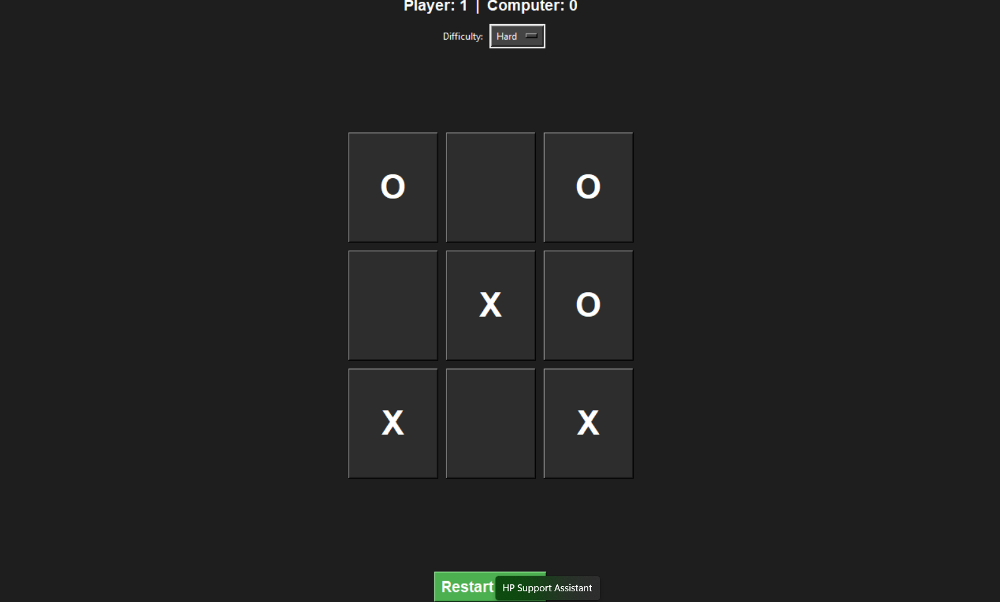

# 🎮 Tic-Tac-Toe GUI Game

A modern Tic-Tac-Toe game built using Python and Tkinter with GUI, animations, and AI difficulty levels.

---

## 🚀 Features
- 🟦 Interactive GUI (Tkinter)
- 🤖 Computer opponent
- 🎯 Difficulty levels (Easy, Medium, Hard)
- 🏆 Score tracking system
- ✨ Hover & click animations
- 🟡 Winning line highlight

---

## 📸 Screenshot


---

## ▶️ How to Run

1. Clone the repository:
```bash
git clone https://github.com/your-username/tic-tac-toe-gui.git